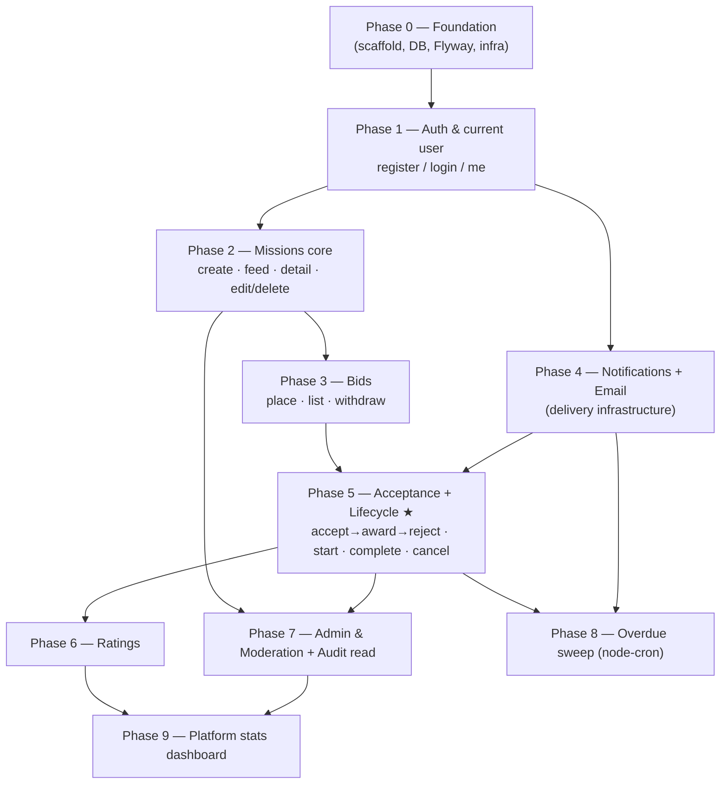

# Drone Missions — Implementation Plan (Next.js + React + Supabase)

A build plan for re-platforming `drone-missions-backend` (Spring Boot) to a unified
TypeScript stack. Covers the **tech stack (with rationale)**, **project structure**, and the
**recommended order of implementation — foundation first, then auth, then vertical by vertical**.

---

## 1. What we're building

A **two-sided drone-mission marketplace**: DESIGNERs post missions → PILOTs bid → a bid is
awarded → the mission runs a lifecycle (DRAFT → PUBLISHED → BIDDING → AWARDED → IN_PROGRESS →
COMPLETED, or CANCELLED) → both parties rate each other. ADMINs moderate (suspend users,
hide/remove missions), with in-app **notifications**, **emails**, an **audit log**, and a
**stats dashboard**. Flight plans (ordered **waypoints** + a **geofence**) are stored as JSON.

Re-platform goal: keep our **own auth** and **Flyway**, use **Supabase purely as managed
Postgres**, deploy as a **long-running Node server**, and build the UI in **React (Next.js)**.

---

## 2. Tech stack (what & why)

### Framework & UI
- **Next.js 15 (App Router) + React 19 + TypeScript** — one framework serving both the React UI
  *and* the API (Route Handlers). Replaces Spring MVC + the separate Angular app. One repo, one
  deploy. *Why:* server components + a single codebase remove CORS, duplicate models, and two
  deploy pipelines.
- **Tailwind CSS + shadcn/ui** — utility CSS + accessible, unstyled component primitives you own.
  *Why:* fast to build, no heavy component-library lock-in.

### Data & persistence
- **Supabase Postgres** — managed Postgres (dashboard, pooler, backups). *Why:* we're already
  Postgres, so the schema moves with ~zero change. Used **only as a database** in v1.
- **`postgres.js`** — the Postgres driver, held as a **persistent connection pool** (`max ~10`)
  in the long-running server. Replaces HikariCP. Connects via Supabase **Supavisor session mode**
  (prepared statements work).
- **Drizzle ORM (`drizzle-orm`)** — type-safe SQL query builder + TypeScript types. *Why:* its
  composable `where(and(...))` matches our dynamic JPA `Specification` filter, `sql``` fragments
  cover the aggregate/projection queries, and it adds no code-gen step. **Drizzle never runs
  migrations** — it only queries and mirrors the schema.
- **`drizzle-kit`** — used *only* for `pull` (introspect the Flyway-migrated DB → `schema.ts`)
  and `check` (CI drift guard).
- **Flyway** — keeps ownership of the schema. The existing `V1..V18` SQL runs **unchanged**
  against Supabase. *Why:* zero rewrite, battle-tested, and it mirrors today's model (Flyway owns
  the schema; the ORM only validates/mirrors — like `ddl-auto=validate`).

### Auth & authorization (our own — no Supabase Auth)
- **`jose`** — sign/verify our HS256 JWTs. Replaces Nimbus `JwtEncoder`/`JwtDecoder`.
- **`bcryptjs`** (or `@node-rs/bcrypt`) — password hashing. Replaces `BCryptPasswordEncoder`;
  existing bcrypt hashes verify as-is.
- **Service-layer guards** (`requireRole()`, `requireOwner()`) — replace `@PreAuthorize` +
  ownership checks. *Why RLS is not used:* we mint our own JWTs, so there is no `auth.uid()` for
  Postgres RLS to key on; authorization stays in the service layer exactly as today.

### Validation
- **`zod`** — one schema per request DTO; cross-field rules (geofence consistency, HOVER needs a
  duration) via `.superRefine()`. Replaces Jakarta Bean Validation + the custom validators.
- **`drizzle-zod`** — derive base Zod shapes from Drizzle tables so validation and table shape
  don't drift.

### Cross-cutting infrastructure
- **`resend` + `react-email`** — transactional email + templates as React components. Replaces
  JavaMailSender + Thymeleaf. `MAIL_ENABLED=false` logs instead of sending in dev.
- **`node-cron`** — in-process scheduled jobs (the overdue-mission sweep). Replaces `@Scheduled`
  — works because the server is always-on.
- **`lru-cache`** — in-process TTL cache for hot mission reads. Replaces Caffeine /
  `CachingMissionDao` (again, viable because the process is persistent).
- **`pino`** — structured logging. Replaces `@Slf4j`/Logback.

### Tooling & deploy
- **Vitest** (unit/integration) + **Playwright** (e2e). **ESLint + Prettier** (replaces Checkstyle).
- **Docker** — Next.js **standalone** output as a long-running Node server (like the Spring jar).
- **pnpm** — package manager.

---

## 3. Locked decisions (recap)

| Decision | Choice |
|---|---|
| App shape | **Unified Next.js app** (React UI + API in one repo/deploy) |
| Supabase role | **Managed Postgres only** (no Auth/RLS/Realtime/Storage in v1) |
| Migrations | **Flyway** — `V1..V18` unchanged |
| ORM | **Drizzle** (query + types only) |
| Auth | **Own** — `jose` + `bcryptjs`; authz in service layer |
| Realtime | **None** (request/refresh) |
| Deploy | **Long-running Node server** (Docker) |
| Local dev DB | **Supabase cloud `dev` project** (separate from prod) |

---

## 4. Project structure (hybrid: feature-first + shared core)

```
drone-missions/
├─ src/
│  ├─ app/                            # ROUTING ONLY
│  │  ├─ (marketing)/                 #   public pages
│  │  ├─ (app)/                       #   authenticated UI (missions, bids, notifications, admin)
│  │  ├─ api/v1/                      #   REST layer — THIN handlers (parse→validate→service→shape)
│  │  │  ├─ auth/  missions/  bids/  ratings/  notifications/  users/  audit-log/  platform-stats/
│  │  └─ layout.tsx
│  │
│  ├─ features/                       # DOMAIN CODE grouped BY FEATURE (hybrid core)
│  │  ├─ missions/
│  │  │  ├─ mission.service.ts        #   business logic          (import 'server-only')
│  │  │  ├─ mission.queries.ts        #   DAO/repository access   (import 'server-only')
│  │  │  ├─ mission.schema.ts         #   Zod
│  │  │  ├─ mission.mapper.ts         #   entity → response DTO
│  │  │  ├─ mission.types.ts
│  │  │  └─ components/               #   mission-specific React UI (colocated)
│  │  ├─ bids/  ratings/  notifications/  users/  auth/  audit/  stats/   (same shape each)
│  │
│  ├─ db/                             # SHARED persistence core
│  │  ├─ schema.ts                    #   Drizzle tables + enums (single source of truth)
│  │  └─ client.ts                    #   postgres.js pool + Drizzle  (import 'server-only')
│  │
│  ├─ lib/                            # SHARED cross-cutting
│  │  ├─ auth/{jwt.ts,password.ts,guards.ts}   # jose + bcryptjs + requireRole/requireOwner
│  │  ├─ api/handler.ts               #   withErrorHandling()  (replaces @RestControllerAdvice)
│  │  ├─ errors.ts                    #   AppError hierarchy   (replaces business/*Exception)
│  │  ├─ audit.ts                     #   AuditService write path (called by mutations)
│  │  ├─ email/{client.ts,templates}  #   resend + react-email
│  │  ├─ cache.ts                     #   lru-cache helpers
│  │  ├─ scheduler.ts                 #   node-cron registration
│  │  ├─ logger.ts                    #   pino
│  │  └─ env.ts                       #   typed, Zod-validated env
│  │
│  ├─ components/ui/                  # SHARED design-system primitives
│  ├─ emails/                         #   React Email templates
│  └─ middleware.ts                   #   verify JWT + attach user (replaces SecurityFilterChain)
│
├─ db/migration/                      # Flyway V1–V18 (unchanged)
├─ flyway.conf   drizzle.config.ts   Dockerfile   docker-compose.yml
├─ .env.local / .env.example   package.json
```

**Rules:** `app/` is routing-only; handlers stay thin; each feature owns its vertical slice;
`import 'server-only'` on every service/query/db module; no barrel `index.ts` in `features/*`;
`middleware.ts` under `src/`. Inside every feature the old Spring layering survives:
**route → service → queries** = **controller → @Service → repository/MissionDao**.

---

## 5. Cross-cutting foundation (built once, reused by every vertical)

Built in Phase 0–1 and then simply *used*:
- **Error model** — `lib/errors.ts` (`AppError` subclasses: `NotFoundError`→404, `ConflictError`→409,
  `ForbiddenError`→403, `UnauthorizedError`→401) + `lib/api/handler.ts` `withErrorHandling()` that
  maps thrown errors + Zod failures to HTTP responses. (= `@RestControllerAdvice`.)
- **Auth kit** — `lib/auth/*`: JWT sign/verify, password hash/verify, `requireRole`/`requireOwner`,
  and `middleware.ts` that verifies the token and attaches the user id/role.
- **Audit write path** — `lib/audit.ts`; each mutation calls it as features land (the admin-facing
  *read* endpoint arrives in Phase 7).
- **Email, cache, scheduler, logger, env** — thin wrappers, introduced when first needed.

---

## 6. Agent working model, sandbox layout & migration discipline

**Migrate by functionality, not by file.** Agents must NOT rewrite the Java project file-by-file.
One vertical collapses a whole Spring stack + its UI into a single Next.js feature slice:

> one `MissionController` + `MissionService` + `MissionRepository` + `Mission` entity + the React
> mission page  →  **one `features/missions/` slice**.

So **every task in the todo list is one entity / one capability — never "convert file X."** The
phase list below already follows this (each phase = one vertical).

**Sandbox layout — read the source, write the target.**

```
.                             ← rw   the new Next.js app — agents WRITE here ONLY
../drone-missions-backend     ← ro   Spring source of truth — READ only
../drone-missions-frontend    ← ro   React/Angular source of truth — READ only
```

Every agent may **READ all three**; every agent **WRITES only to the first**. Enforce read-only on
the two source repos (via permission deny rules in `.claude/settings.local.json`, and always via
the agent's system prompt).

**Always work from the open original — never from memory.** The implementer ports behavior from the
*actual* Spring/React source it has open, not from this plan's paraphrase. **This plan is the map;
the source repos are the ground truth.** If the plan and the source disagree, the source wins — and
flag it. This holds whether one agent or a fleet of agents runs the phases.

**Everything is covered by tests.** A vertical is not "done" until its tests pass. Note: **JUnit is
Java-only** — in this TypeScript stack the equivalent is **Vitest** (unit/integration ≈ JUnit +
Mockito) + **Playwright** (e2e). Where the Spring project has JUnit tests, **mirror each case in
Vitest** so behavior is provably preserved.

---

## 7. Recommended implementation order

Ordered by **real domain dependencies** — nothing is built before the thing it needs exists.
Foundation → auth → the marketplace core (missions → bids) → the transactional heart
(acceptance + lifecycle, which needs notifications/email) → the rest (ratings, admin, cron, stats).



**Frontend strategy:** go **full-stack per vertical** — each phase ships its own React UI, so you
always have a clickable app to test.

### Phase 0 — Foundation _(no user-facing features)_
Scaffold Next.js + TS + Tailwind + shadcn; Docker + `docker-compose`; `lib/env.ts`;
`db/client.ts` (postgres.js pool + Drizzle); wire **Flyway** at the Supabase dev project and run
`migrate`; `drizzle-kit pull` → `schema.ts`; `lib/errors.ts` + `lib/api/handler.ts` + `pino`;
a `/api/health` route; CI (lint, typecheck, `drizzle-kit check`).
**Done when:** app boots in Docker, connects to Supabase, migrations applied, health check green, CI passes.

### Phase 1 — Auth & current user _(register / login)_ — depends: P0
The unlock for everything (every vertical needs "who is the caller" + role).
Build `lib/auth/*` (jose, bcryptjs, guards), `middleware.ts`.
**Endpoints:** `POST /auth/register` (DESIGNER/PILOT; block ADMIN), `POST /auth/login`
(returns JWT), `POST /auth/logout`, `GET /users/me`.
**UI:** register + login pages, authed app shell, logout.
**Done when:** register a designer & a pilot, log in, `GET /users/me` works, protected routes reject anonymous, roles enforced.

### Phase 2 — Missions core _(the heart)_ — depends: P1
The central entity; bids/ratings/lifecycle can't exist without it. Introduce the **audit write
path** here and log mission create/update/delete.
**Endpoints:** `POST /missions` (designer), `GET /missions` (open feed, `?location&keyword&date`
— the dynamic filter = old `Specification`), `GET /missions/my-missions`, `GET /missions/{id}`,
`PUT /missions/{id}`, `DELETE /missions/{id}`. Zod for the flight plan (waypoints ≥2, geofence
consistency, HOVER duration). Optional `lru-cache` on reads.
**UI:** create-mission form (waypoints + geofence), feed with filters, mission detail, my-missions.
**Done when:** a designer creates a mission, it shows in the filtered feed, owner can edit/delete, invalid flight plans are rejected.

### Phase 3 — Bids _(place / list / withdraw)_ — depends: P2
Pilots act on existing missions; needed before acceptance.
**Endpoints:** `POST /bids/mission/{missionId}` (place/update — one per pilot per mission),
`GET /bids/mission/{missionId}` (owner sees all, others see own), `GET /bids/my` (pilot),
`DELETE /bids/{id}` (withdraw). _(Accept is Phase 5.)_
**UI:** bid form on mission detail, bids list, my-bids.
**Done when:** a pilot places/updates/withdraws a bid, one-per-pilot enforced, designer sees bids on their mission.

### Phase 4 — Notifications + Email _(delivery infrastructure)_ — depends: P1
Built now because Phase 5 is the first to emit them.
**Notifications:** `GET /notifications`, `GET /notifications/unread-count`,
`POST /notifications/{id}/read`, `POST /notifications/read-all`; service with dedupe.
**Email:** `lib/email` (Resend) + React Email templates (new-bid, bid-accepted, bid-rejected,
mission-cancelled, mission-overdue); `MAIL_ENABLED` flag (log in dev).
**UI:** notification bell + unread badge + list + mark-read.
**Done when:** a notification appears with a correct unread count; an email renders (logged in dev).

### Phase 5 — Acceptance + Mission lifecycle ★ _(transactional core)_ — depends: P3, P4
The marketplace's beating heart; uses **DB transactions** and fires notifications/emails.
**Endpoints:** `POST /bids/{id}/accept` (accept one → **award mission + reject other bids** in a
transaction → notify + email), `POST /missions/{id}/start` (pilot), `POST /missions/{id}/complete`
(pilot), `POST /missions/{id}/cancel` (designer → cancel + reject bids + notify/email),
`GET /missions/my-jobs` (pilot).
**UI:** accept (designer), start/complete (pilot), cancel (designer), my-jobs page.
**Done when:** happy path works end-to-end — accept awards the mission, other bids go REJECTED, notifications+email fire; pilot starts→completes; cancel triggers its side effects.

### Phase 6 — Ratings — depends: P5
Both participants rate once, only after completion.
**Endpoints:** `POST /ratings/mission/{missionId}`, `GET /ratings/mission/{missionId}`,
`GET /ratings/user/{userId}` (average + count + comments; also feeds `designerRating` on missions).
**UI:** rate form post-completion, rating summary on profile/mission.
**Done when:** both sides rate a completed mission once, averages compute and surface.

### Phase 7 — Admin & Moderation + Audit read — depends: P2, P5 (+ audit writes accrued)
**Endpoints:** `GET /users` (paged, `?role`), `POST /users/admins`, `POST /users/{id}/suspend`,
`POST /users/{id}/reactivate`, `GET /users/{id}` (public profile), `GET /missions/all` (`?q`),
`POST /missions/{id}/hide|unhide`, `POST /missions/{id}/remove`, `GET /audit-log`
(`?actorId&action&role&q`).
**UI:** admin dashboard shell, users table (suspend/reactivate), moderation table (hide/remove),
audit-log table.
**Done when:** admin can list/suspend users, hide/remove missions, browse the audit log; non-admins rejected.

### Phase 8 — Overdue sweep _(scheduled)_ — depends: P5, P4
`node-cron` daily job (Europe/Belgrade) → find AWARDED missions past `endTime` → notify the pilot
(in-app + email) once (dedupe). Replaces `OverdueNotificationScheduler`.
**Done when:** an overdue awarded mission produces exactly one notification + email per run.

### Phase 9 — Platform stats dashboard — depends: all data verticals
`GET /platform-stats` (admin) — counts by status/role, bid volume, top missions by bids, rating
summaries (Drizzle aggregate / `sql` queries). **UI:** admin stats dashboard.
**Done when:** the dashboard shows accurate aggregates.

### Vertical summary

| Phase | Vertical | Key endpoints | Depends on |
|---|---|---|---|
| 0 | Foundation | `/api/health` | — |
| 1 | Auth & user | register, login, logout, `/users/me` | 0 |
| 2 | Missions core | missions CRUD + feed | 1 |
| 3 | Bids | place/list/withdraw | 2 |
| 4 | Notifications + Email | notifications list/read; email infra | 1 |
| 5 ★ | Acceptance + lifecycle | accept, start, complete, cancel, my-jobs | 3, 4 |
| 6 | Ratings | rate, user ratings | 5 |
| 7 | Admin + audit read | user/mission admin, audit-log | 2, 5 |
| 8 | Overdue sweep | node-cron job | 4, 5 |
| 9 | Platform stats | `/platform-stats` | all |

---

## 8. Local development setup (DB = Supabase cloud `dev` project)

1. Two Supabase projects: `drone-missions-dev` and `drone-missions-prod` (never migrate/test on prod).
2. `.env.local`:
   ```
   DATABASE_URL=postgres://…@…pooler.supabase.com:5432/postgres   # app pool (session mode)
   FLYWAY_URL=jdbc:postgresql://…:5432/postgres                    # direct/session for Flyway
   JWT_SECRET=…            JWT_EXPIRATION_MS=86400000
   RESEND_API_KEY=…        MAIL_ENABLED=false
   ```
3. `flyway -configFiles=flyway.conf migrate` → applies V1–V18 to the dev project.
4. `drizzle-kit pull` → regenerates `db/schema.ts`; CI runs `drizzle-kit check` to catch drift.
5. `pnpm dev` → local Next.js server against the Supabase dev DB.
6. Optional `seed.ts` for sample designers/pilots/missions.

> Trade-off: a cloud dev DB means network latency + shared state — prefer a **personal dev
> project** per developer. A local Postgres in Docker stays a drop-in fallback (only the
> connection string changes).

---

## 9. Verification / testing strategy

**Every vertical is covered by tests before it counts as done.** JUnit is Java-only — the
equivalent here is **Vitest** (unit/integration ≈ JUnit + Mockito) + **Playwright** (e2e); where
the Spring app has JUnit tests, mirror each case in Vitest so behavior is provably preserved.

- **Schema:** `flyway migrate` clean on dev; `drizzle-kit check` shows `schema.ts` matches.
- **Contract parity:** each route returns the same shape/status as Spring (compare vs Swagger / an HTTP collection).
- **Authorization (Vitest):** PILOT can't read another pilot's bids; DESIGNER can't mutate another's mission; ADMIN routes reject non-admins.
- **Validation (Vitest):** bad payloads (missing name, <2 waypoints, HOVER without duration, inconsistent geofence) → 400 with field errors.
- **Lifecycle e2e (Playwright):** register → post mission → bid → accept (AWARDED; others REJECTED; email logged) → start → complete → both rate.
- **Cron:** the sweep marks overdue awarded missions once and notifies.

Suggested rule: each phase ships with its own Vitest suite + a Playwright happy-path before moving on.
